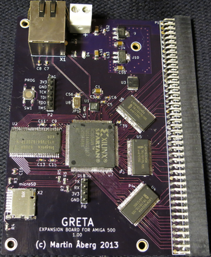
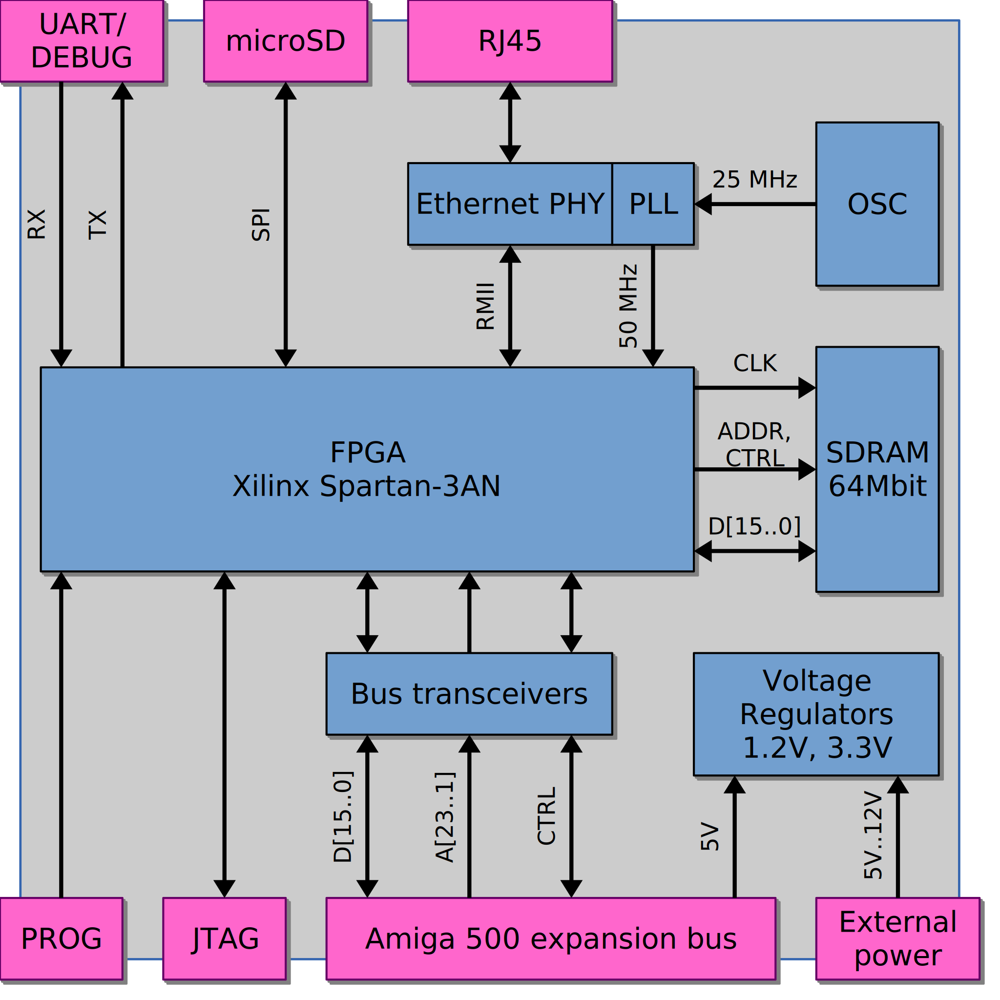

# About
Expansion board for the Amiga A500 computer providing SDRAM, Secure Digital
mass storage and Ethernet interface.

# Features
- Attaches to the Amiga A500 expansion bus
- 8 MiB Fast RAM
  - Zero wait state
  - Always available to the system via Amiga AUTOCONFIG protocol
- SPI controller
  - For interfacing with Secure Digital storage
- 10/100Mbit Ethernet PHY

# Hardware overview

## FPGA
Xilinx Spartan-3AN is used for control logic. This FPGA device
is equipped with an internal bitstream flash.

## Bus transceivers
The Amiga computer uses 5V signalling while the FPGA and the other
expansion board components operate at 3.3V. Signal level conversion
and bus isolation is solved by using 5V-tolerant 3.3V drivers for
signals between the computer to the expansion board.

## Bus protocol
A500 expansion bus protocol is equivalent to the MC68000 processor
bus protocol. The MC68000 bus control signals are sampled by the
FPGA, synchronized, and bridged to an internal custom bus protocol
with time-slots allocated to on-board peripherals.

## Voltage regulators
3.3V and 1.2V are generated by on-board voltage regulators, powered
by the expansion bus connector.

## Clocking
A 50 MHz input clock is generated by the Ethernet PHY. This clock
is synchronous with the PHY RMII signals. The FPGA logic and SDRAM
operate at 133 MHz.

# Status
- Full support for the 8 MiB zero waitstate SDRAM is implemented.

- AmigaOS AUTOCONFIG for device discovery implemented.

- An SPI controller is implemented and is currently being used for
  developing an AmigaOS compliant disk controller driver with SCSI
  emulation.

- An Ethernet MAC with DMA is still to be implemented.

- Gerber files are readily available and can be sent to a PCB
  manufacturer for production. Refer to the schematic files for
  bill of materials (BOM).

# Documentation
Details of the design is documented in the
[Technical description](greta.pdf).

Schematic and layout files are available in the
[pcb](pcb) directory.
A PDF rendering of the schematic can be found in
[doc/schematic.pdf](doc/schematic.pdf).

# Tools
The following tools have been used in the development of hardware
and HDL:
- **KiCad**: schematic and PCB layout
- **GHDL**: RTL simulation and testbenches
- **Xilinx ISE**: Xilinx FPGA synthesis and layout

# Authors
Martin Åberg - <martin@fripost.org>

# License
All schematics, PCB layout and VHDL code described in this document
are released under the GNU General Public License.

